# Faster_R-CNN

# Introduction

Στην παρούσα εργασία θα ασχοληθούμε με τον τομέα της ανίχνευσης αντικειμένων. Πιο συγκεκριμένα θα υλοποιήσουμε σε Keras ένα Faster R-CNN το οποίο και θα εκπαιδεύσουμε ώστε να ανιχνεύει σε μια εικόνα **ανθρώπους**, **σκύλους**, **γάτες**.

Επέλεξα  να τρέξω το μοντέλο στο colab. Ώστε να εκμαιταλευτω την Tesla K80 που παρέχει η google.
Το μοντέλο εκπαιδεύτηκε με 2,412 εικόνες οι οποίες περιείχαν συνολικά 5937 αντικείμενα τα οποία άνηκαν σε μια από τις 3 κατηγορίες. Συνολικά η εκπαίδευση διήρκησε 16 ώρες και το Total loss ήταν 0,79 .

Τα παρακάτω αποτελέσματα προέκυψαν από ένα test set 600 εικόνων οι οποίες περιείχαν 1368 αντικείμενα.

# Resutls
### Cats
<table>
  <tr>
    <td></td>
     <td></td>
     <td></td>
  </tr>
  <tr>
    <td>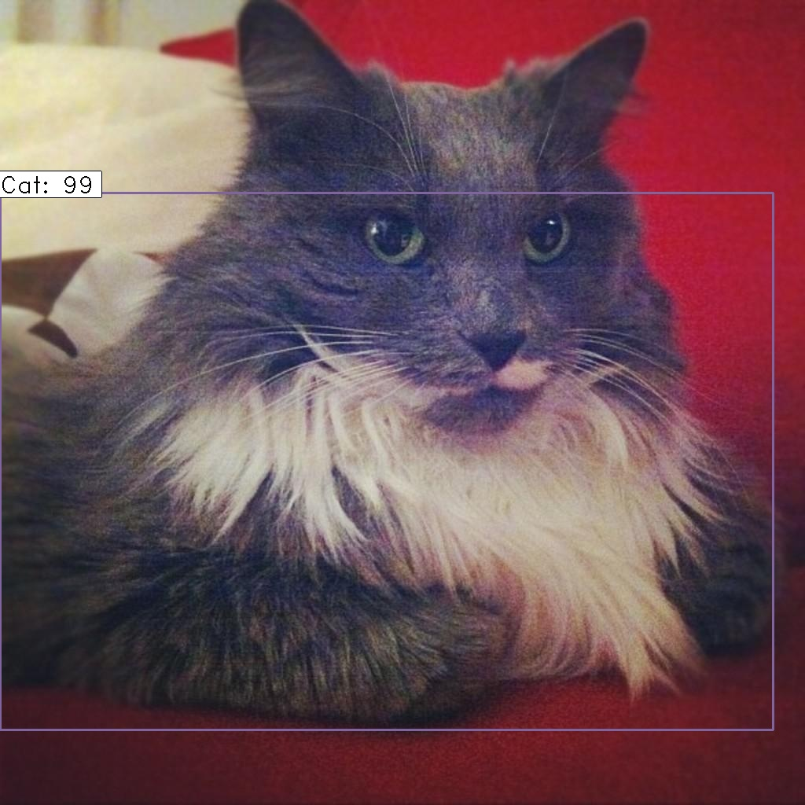</td>
    <td>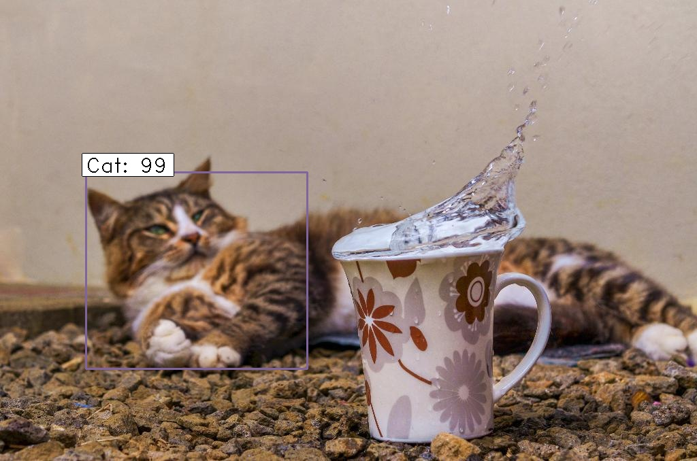</td>
    <td>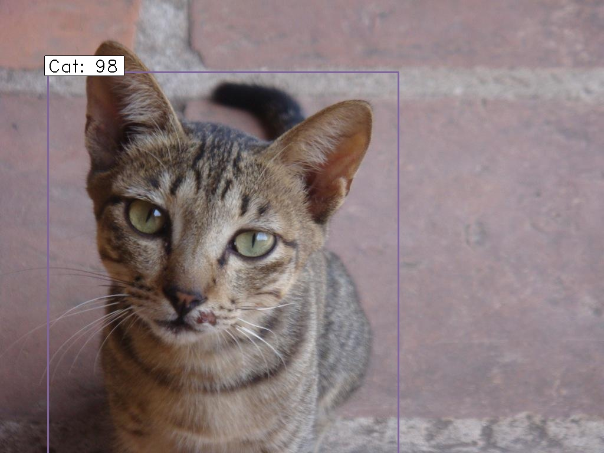</td>
  </tr>
 </table>
 
### Dogs
 <table>
  <tr>
    <td></td>
    <td></td>
    <td></td>
  </tr>
  <tr>
    <td>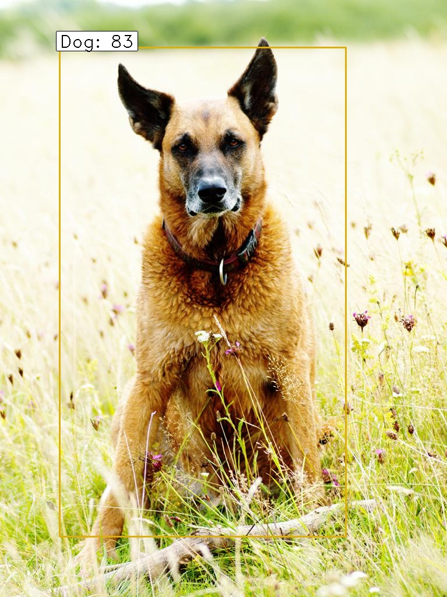</td>
    <td>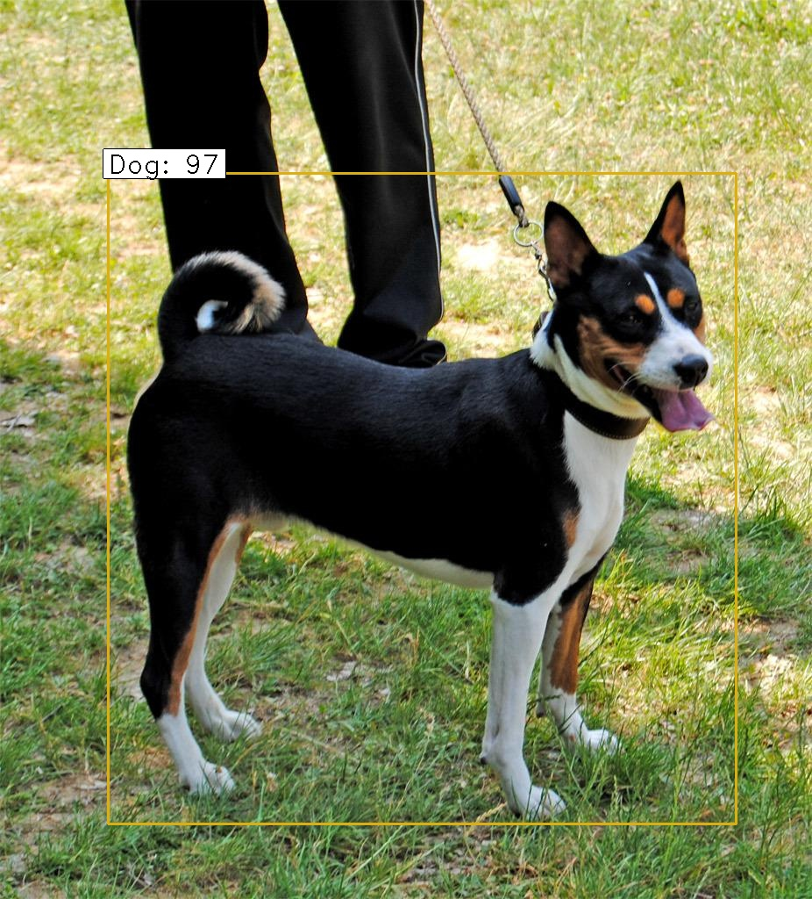</td>
    <td>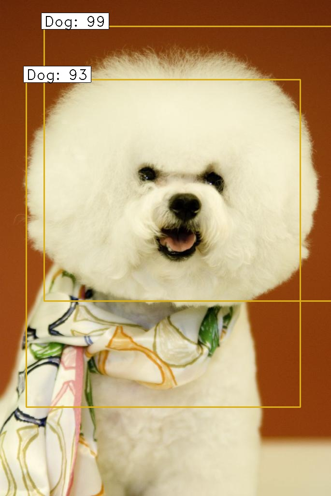</td>
  </tr>
 </table>
 
 ### Persons
 <table>
  <tr>
    <td></td>
    <td></td>
    <td></td>
  </tr>
  <tr>
    <td>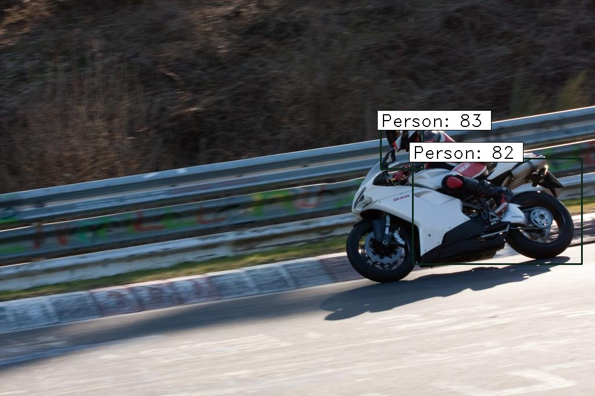</td>
    <td>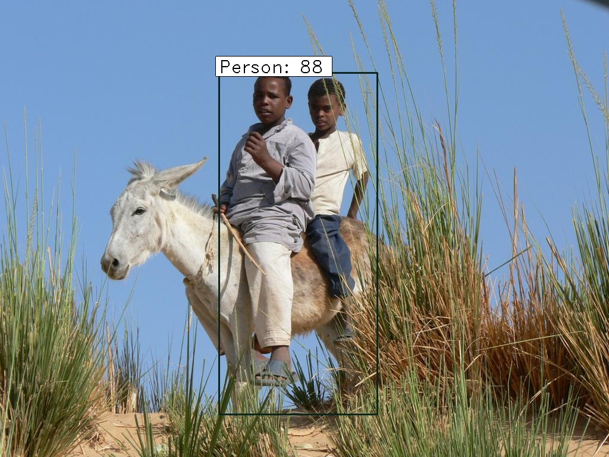</td>
    <td>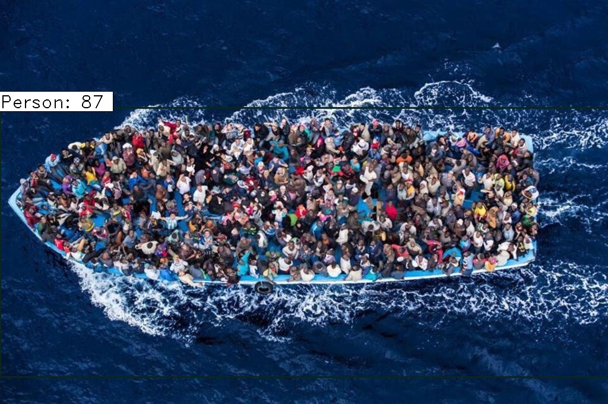</td>
  </tr>
 </table>
 
 # Metrics
 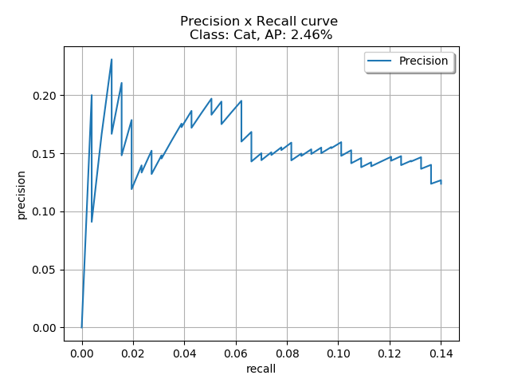
  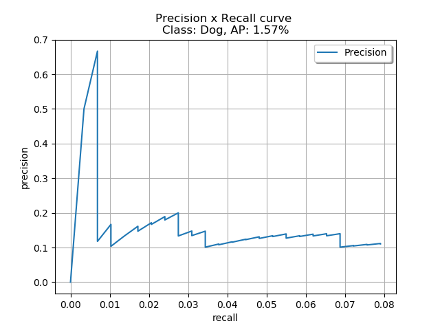
   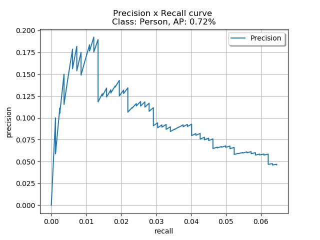
 
 
 Όπως βλέπουμε και από τις ίδιες τις εικόνες άλλα και από τις μετρικές το μοντέλο είναι πιο κάλο στο να βρίσκει γάτες λιγότερο καλό στο να βρίσκει σκύλους και χειρότερο στο να βρίσκει ανθρώπους. Κάτι τέτοιο μπορούμε να το παρατηρήσουμε και από τις ίδιες τις εικόνες όπου είχαμε πάρα πολλά false positives στους ανθρώπους.
